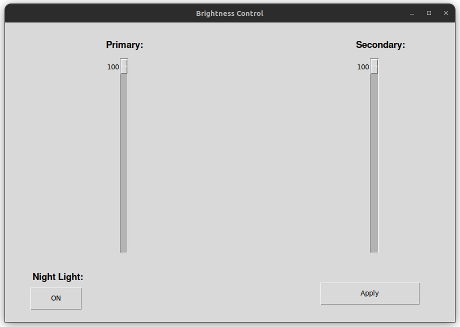

# Brightness_Control
This is a brightness control app for Linux. 
It is made completely in python it is just a fun project i did.
This is just an alpha release and will be updated in the future.
I plan on adding more features to this app 

Installation:

You can download it by using 'git clone' command
or download the zip file and extract it.
After that just run the brightness.py file by 

Current Features:
Can change the brightness
Can enable night light
Supports multiple monitors

python brightness.py

Note: Currently it works only on Linux and may have bugs but will be updated soon.

